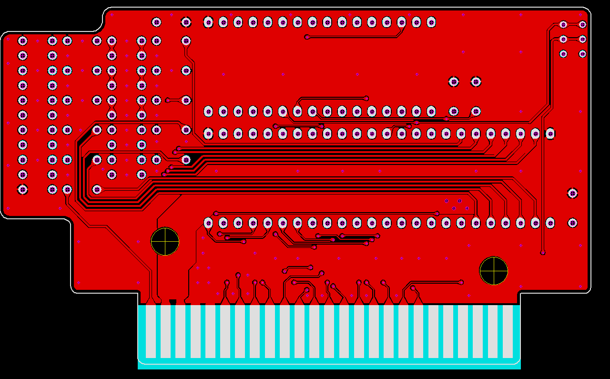
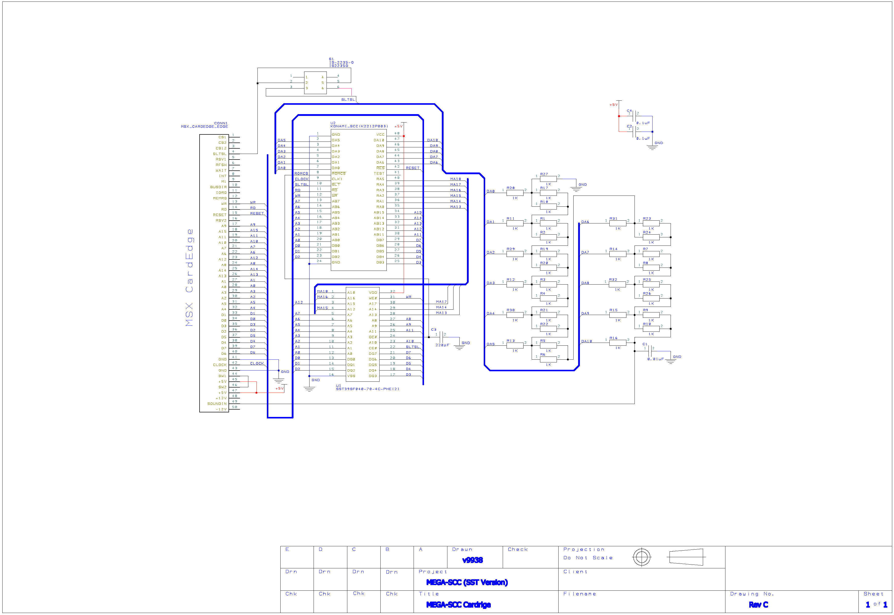

# MSX MEGA-SCC (似非SCC) SST Flash version  

SCCのFlash CartridgeとしてMEGA-SCC(似非SCC)が有名ですが、
使用しているFlash ROM AM29F040Bの入手が近年難しいのが難点でした。  
  
そこで、入手が容易なSST社のFlash ROMでなんとかならんかと  
HRA!(@thara1129)さんが思いついたAddress入れ替えによるMEGA-SCCを基板化したものが本製品になります。

原案：  
<https://github.com/hra1129/MSX_MegaSCC_for_SST39SF040>

  

  

## ■ 本製品のキット頒布について

下記2ショップで取り扱っていただいています。  

家電のKENちゃん  
<https://www.kadenken.com/view/item/000000001450>  

BEEPさん  
<https://www.beep-shop.com/ec/products/detail/26575>  

本キットの組み立てにはSCC (2212P003) を実カートリッジから取り外す必要があります。  

DACのKONAMI051650については取り外し不要です。  
基板上に等価回路を実装しています。  

シェルはKONAMIのMSX CassetteまたはRGR製のTransparent Cartridge Shell for MSX Konami-styleに対応しています。

## ■ KONAMI純正シェルを使用する方へのお願い（RevA/B 基板）

当方の基板サイズの計測ミスでケースと干渉することが分かりました。  
使用する場合は、干渉する左上3x8mm程度をカットするようにお願いします。（下記図参考)  
なお、当該部分は配線などが無いため動作に影響はありません。  

  

## ■ SCCとの結線について

HRA!(@thara1129)さんの方法通りです。A12とMA15を入れ替えます。
  

## ■ カートリッジ基板について

回路図、および基板のガーバデータを同梱しています。  
  
SCCチップ(2212P003)については、実カートリッジから取り外して実装してください。  
DACのKONAMI051650については、取り外しの難易度が高いのでHICの等価回路を基板上に実装しています。  
  
  
    

## ■ 回路図

全体の回路図については下記を参照してください。
  

## ■ 部品表

| 部品番号 | 部品名 |
|---|---|
| U1  | Flash ROM SST39SF040 |
| U2  | KONAMI SCC CHIP 2212P003 |
| C1  | 積層セラミック コンデンサー0.01uF (103) |
| C2/C4  | 積層セラミック コンデンサー0.1uF (104) |
| C3  | 積層セラミック コンデンサー220pF (221) |
| R1-32  | 1KΩ(5%) 1/8W |
| S1  | スイッチ IS-2235 (RevB～)|  

  

## ■ 基板の組み立て方法

セオリー通り背の低い部品から半田付けしてください。  
ICソケットを使うとケースに入らなくなるので注意してください。  

1．R1-32を実装  
  

2．S1/C1-4を実装  
  

3．U1/2を実装  
  

## ■ 基板上のスイッチについて(RevB以降)

スロット選択信号の有効/無効の切り替えスイッチになっています。  
再書き込みなどで一次的にCartridgeを無効化する場合に使用ください。
  

## ■ Flashの制御方法

BANK0=0x01/BANK1=0x06に設定することで、
Flashのコントロールアドレス2AAAhは4AAAh・コントロールアドレス5555hは6555hにマッピングされます。  

SST系のFlashは、上位アドレスを見てしまうので従来の結線通りにしてしまうと、コントロールアドレスに  
書き込み時にバンクアドレスが切り替わってしまい。上手くコントロールできません。  
それを回避するためにA12とMA15を入れ替えてその問題に対応しています。

なお、CMD体系自体は、AMD系とほぼ同じです。  
BUSYの出方はAMD系と異なるため注意してください。  

参考：  
<https://www.microchip.com/wwwproducts/en/SST39SF010A>  
  
## ■ Flash書き込みプログラム

●書き込み  
`>sstscc.com [書き込みFile名]`  

ソースコードは、z88dkでコンパイル可能です。コンパイルオプションは下記になります。  
`zcc +msx -create-app -subtype=msxdos -lmsxbios  main.c -o xxxx.com`  
  
  HRA!(@thara1129)さん謹製のwrtsstの方が動作が速いのでおすすめです＾＾；  
<https://github.com/hra1129/MSX_MegaSCC_for_SST39SF040/tree/main/tools>
