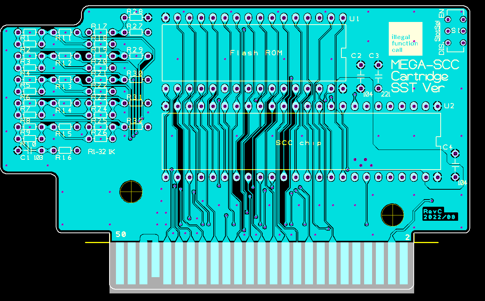

# MSX 似非SCC (SST Flash version)  

HRA!(@thara1129)さんが思いついた。  
似非SCC SST Flash Versionの書き込みプログラムサンプルです。  

## ■ SCCとの結線方法について
HRA!(@thara1129)さんの方法通りです。A12とMA15を入れ替えます。
  

## ■ Flashの制御方法
BANK0=0x01/BANK1=0x06に設定することで、
Flashのコントロールアドレス2AAAhは4AAAh・コントロールアドレス5555hは6555hにマッピングされます。  

SST系のFlashは、上位アドレスを見てしまうので従来の結線通りにしてしまうと、コントロールアドレスに  
書き込み時にバンクアドレスが切り替わってしまい。上手くコントロールできません。  
それを回避するためにA12とMA15を入れ替えてその問題に対応しています。

なお、CMD体系自体は、AMD系とほぼ同じです。  
BUSYの出方はAMD系と異なるため注意してください。  

参考：  
https://www.microchip.com/wwwproducts/en/SST39SF010A  
  
## ■ Flash書き込みプログラム

●書き込み  
`>sstscc.com [書き込みFile名]`  

ソースコードは、z88dkでコンパイル可能です。コンパイルオプションは下記になります。  
`zcc +msx -create-app -subtype=msxdos -lmsxbios  main.c -o xxxx.com`  
  
  
## ■ カートリッジ基板について
回路図、および基板のガーバデータを同梱しています。（ただし、2021/5/8 現在動作未検証)  
  
SCCチップ(2212P003)については、実カートリッジから取り外して実装してください。  
DACのKONAMI051650については、取り外しの難易度が高いので等価回路を実装しています。  
  
  
    

  
  

## ■ 基板の組み立て方法
セオリー通り背の低い部品から半田付けしてください。R1-32 > U1/2 >C1-4が良いと思います。  
ICソケットを使うとケースに入らなくなるので注意してください。  

## ■ 部品表
| 部品番号 | 部品名 |
|---|---|
| U1  | Flash ROM SST39SF040 |
| U2  | KONAMI SCC CHIP 2212P003 |
| C1  | 積層セラミック コンデンサー0.01uF (103) |
| C2/C4  | 積層セラミック コンデンサー0.1uF (104) |
| C3  | 積層セラミック コンデンサー220pF (221) |
| R1-32  | 1KΩ(5%) 1/8W |
  
